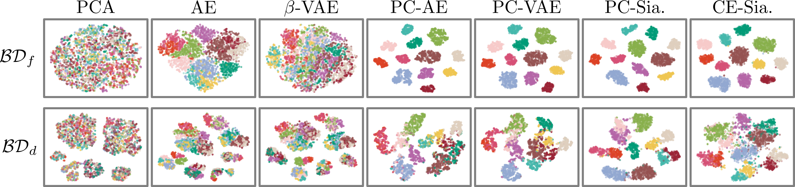

# State Representation Learning with Task-Irrelevant Factors of Variation in Robotics
This is the code for the paper: State Representation Learning with Task-Irrelevant Factors of Variation in Robotics

Visit the dedicated website: [here](https://anonymous-icml2021.github.io/website/) for more information.

If you use this code in your work, please cite it as follows:


## Bibtex

```
Avalible after Puplication
```

## Training the Moddels

### setup

```
pip install -r requirements.txt
```

### Datasets
prepare datasets:
```
cd datasets
chmod +x get_datasets.sh
./get_datasets.sh
```

### Augment Shelf Datasets
prepare datasets:
```
python preprocess_dataset/augment_dataset.py --pkl_dataset='datasets/2500_shelf_stacking' --noac_swaps=0 --ac_rand_mul=2
python preprocess_dataset/augment_dataset.py --pkl_dataset='datasets/2500_shelf_stacking' --noac_swaps=1 --ac_rand_mul=1
python preprocess_dataset/augment_dataset.py --pkl_dataset='datasets/2500_shelf_stacking' --noac_swaps=1 --ac_rand_mul=2
```

```
python preprocess_dataset/augment_dataset.py --pkl_dataset='datasets/2500_shelf_stacking_all_distractors' --noac_swaps=0 --ac_rand_mul=2
python preprocess_dataset/augment_dataset.py --pkl_dataset='datasets/2500_shelf_stacking_all_distractors' --noac_swaps=1 --ac_rand_mul=1
python preprocess_dataset/augment_dataset.py --pkl_dataset='datasets/2500_shelf_stacking_all_distractors' --noac_swaps=1 --ac_rand_mul=2
```


### Train PCA; PC-Sia.; CE-Sia. Models
Box stacking task:

```
python run_box_stacking_pca_siam_simclear.py
```

Shelf arranging task:
```
python run_shelf_arrangment_pca_siam_simclear.py
```

### Train AE; PC-AE; VAE; PC-VAE

Builds on code work from: [Latent Space Roadmap website](https://visual-action-planning.github.io/lsr/)
```
python prepare_recon_dataset_for_cluster.py
```

```
chmod +x run_train_recon_models.sh
./run_train_recon_models.sh
```

### Inference AE; PC-AE; VAE; PC-VAE
To get the encodins and plots run:

```
python produce_recon_models_encodings.py
```


### Results

The representations are saved in the model folder togheter with the t-SNE plots:




